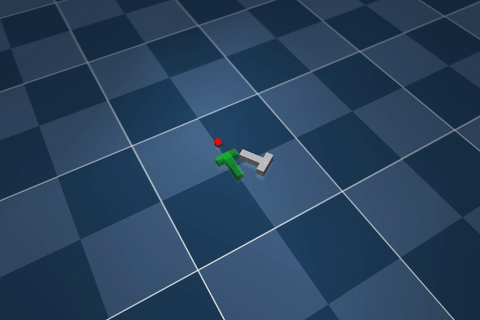
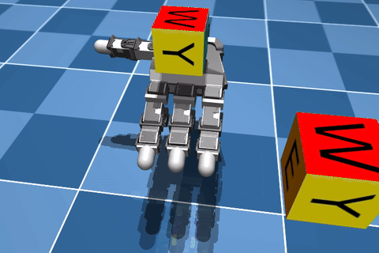
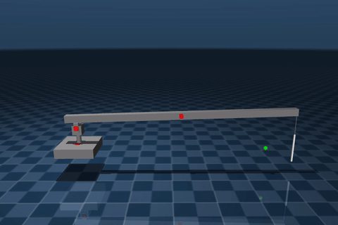

# Model Tensor Planning (MTP)

[](https://arxiv.org/abs/2505.01059)
[](https://sites.google.com/view/tensor-sampling/)
[](LICENSE)
[](https://python.org)
[](https://jax.readthedocs.io/)

**Model Tensor Planning** is a sampling-based MPC framework that generates
*globally diverse* trajectory candidates by sampling paths through a
randomized M-partite graph and interpolating each path with a smooth
spline. It runs entirely on GPU via JAX + MuJoCo MJX and plugs into
[hydrax](https://github.com/vincekurtz/hydrax) as a drop-in controller.

> **Paper:** [Model Tensor Planning](https://arxiv.org/abs/2505.01059) -
> An T. Le, Khai Nguyen, Minh Nhat Vu, João Carvalho, Jan Peters · TMLR 2025

<p float="middle">
  
  
  
</p>

---

## Why MTP?

Local samplers (PS, MPPI, CEM) work well around an existing trajectory
but get trapped in local minima - e.g. when the straight line from start
to goal goes through a wall. MTP injects **structured global exploration**
on top of a CEM-style local update:

- A **tensor graph** of `M` layers x `N` candidates encodes every
  combination of waypoints; a path is one index per layer.
- `β · num_samples` paths are sampled from the graph and interpolated
  (Akima / B-spline / linear) into smooth control trajectories.
- The remaining `(1 − β) · num_samples` are local CEM perturbations
  around the current best plan.
- All trajectories are rolled out in parallel through MJX (with optional
  domain randomization), elites are picked with `jax.lax.top_k`, and the
  CEM mean / variance are updated with a softmax-weighted, baseline-
  subtracted, Bessel-corrected estimator.

See [`examples/navigation.py`](examples/navigation.py): PS / MPPI / CEM
get stuck behind the U-shaped wall; MTP routes around it.

## Install

Requires Python >= 3.12 and a recent CUDA toolchain for GPU rollouts.

```bash
git clone https://github.com/anindex/mtp.git
cd mtp
uv venv --python 3.12 .venv && source .venv/bin/activate
uv pip install -e .
```

`pip install -e .` works equivalently. Hydrax is pinned to a known-good
commit; bump it explicitly in [pyproject.toml](pyproject.toml).

## Quick start

```python
import mujoco
from hydrax.tasks.pendulum import Pendulum
from hydrax.simulation.deterministic import run_interactive
from mtp import MTP

task = Pendulum()
ctrl = MTP(
    task,
    num_samples=128,
    M=3, N=50,                 # 3-layer graph, 50 candidates per layer
    beta=0.5,                  # 50 % tensor paths, 50 % local CEM
    mtp_interpolation="akima", # "akima" | "bspline" | "linear"
    plan_horizon=1.0,
    num_knots=10,
    spline_type="zero",        # hydrax low-level control spline
)

mj_model = task.mj_model
mj_data = mujoco.MjData(mj_model)
run_interactive(ctrl, mj_model, mj_data, frequency=25)
```

## Examples

Each example accepts `mtp` / `ps` / `mppi` / `cem` as a positional argument:

| Example | Highlights |
| --- | --- |
| [`navigation.py`](examples/navigation.py) | U-maze with a local minimum; MTP escapes, others don't |
| [`pendulum.py`](examples/pendulum.py) · [`double_cart_pole.py`](examples/double_cart_pole.py) · [`walker.py`](examples/walker.py) | Classic underactuated benchmarks |
| [`pusht.py`](examples/pusht.py) · [`cube.py`](examples/cube.py) · [`crane.py`](examples/crane.py) | Contact-rich manipulation |
| [`g1_standup.py`](examples/g1_standup.py) · [`g1_mocap.py`](examples/g1_mocap.py) | Unitree G1 humanoid |

```bash
python examples/navigation.py mtp
python examples/pusht.py    mppi   # baseline comparison
```

Visualize the spline tensor structures with
[`scripts/plot_splines.py`](scripts/plot_splines.py).

## Tuning

### MTP-specific (see [`mtp/mtp.py`](mtp/mtp.py))

| Symbol | Argument | Description | Typical |
| --- | --- | --- | --- |
| `M` | `M` | Graph depth (waypoint layers) | 2-5 |
| `N` | `N` | Graph width (candidates / layer) | 20-100 |
| `β` | `beta` | Tensor / CEM mix (1.0 = all tensor) | 0.1-1.0 |
| `K` | `num_elites` | Elite count for the CEM update | 5-50 |
| `σ_min`, `σ_max` | `sigma_min`, `sigma_max` | Variance clamp | 0.05-1.0 |
| `α` | `alpha` | Variance smoothing (0 = full update) | 0.0-0.5 |
| `λ` | `temperature` | Softmax temperature for elites | 0.01-1.0 |
| - | `mtp_interpolation` | `"akima"` (local, no overshoot), `"bspline"` (globally smooth, requires `M >= degree + 1`), `"linear"` | - |
| - | `degree` | B-spline degree (>= 2) | 2-4 |

### Hydrax control spline (inherited)

| Argument | Description | Typical |
| --- | --- | --- |
| `plan_horizon` | Planning horizon, seconds | 0.1-2.0 |
| `num_knots` | Hydrax spline knots | 4-20 |
| `spline_type` | `"zero"`, `"linear"`, `"cubic"` | `"zero"` |
| `num_randomizations` | Domain-randomized rollouts | 1-8 |

### Smoothing the viewer

`hydrax.simulation.deterministic.run_interactive` runs the controller and
viewer in the same thread, so realtime rate ≈ `min(frequency, 1 / plan_time)`.
If the viewer feels choppy:

1. Lower `frequency` (e.g. 50 -> 25 Hz) to widen the per-replan budget.
2. Lower `num_samples` and/or `num_randomizations` - total work scales
   as `num_samples · num_randomizations · ctrl_steps`.
3. Lower `max_traces` (and `trace_width`) on `run_interactive` - each
   trace is a Python `mjv_connector` loop redrawn every replan.
4. Press **Tab** inside the viewer to hide the side panels.

## Project layout

```
mtp/
├── mtp.py                # MTP controller (tensor sampling + CEM update)
├── splines/
│   ├── akima.py          # Modified-Akima cubic, vectorized for JAX
│   └── bsplines.py       # Cox-de Boor B-spline basis matrix
├── tasks/
│   └── navigation.py     # Vendored U-maze particle task (local-minimum demo)
└── models/particle/      # MJCF assets shipped via package-data

examples/   # one runnable script per task, all four algorithms
scripts/    # plotting helpers
demos/      # GIFs used in this README
```

## Citation

```bibtex
@article{le2025model,
  title   = {Model Tensor Planning},
  author  = {An Thai Le and Khai Nguyen and Minh Nhat Vu and Joao Carvalho and Jan Peters},
  journal = {Transactions on Machine Learning Research},
  issn    = {2835-8856},
  year    = {2025},
  url     = {https://openreview.net/forum?id=fk1ZZdXCE3}
}

@misc{kurtz2024hydrax,
  title  = {Hydrax: Sampling-based model predictive control on GPU with JAX and MuJoCo MJX},
  author = {Kurtz, Vince},
  year   = {2024},
  note   = {https://github.com/vincekurtz/hydrax}
}
```

## Acknowledgments

Built on [Hydrax](https://github.com/vincekurtz/hydrax) and
[MuJoCo MJX](https://github.com/google-deepmind/mujoco). Thanks to
[Vince Kurtz](https://github.com/vincekurtz) for the upstream framework.
