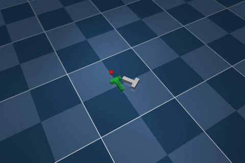

# Model Tensor Planning (MTP)

This repository contains the official implementation of **Model Tensor Planning (MTP)**, a sampling-based model predictive control (MPC) framework that performs high-entropy control generation using structured tensor sampling.  See [project website](https://sites.google.com/view/tensor-sampling/).

MTP is implemented entirely in **JAX** and supports real-time control in high-dimensional systems with GPU acceleration via JIT and MuJoCo XLA.

<p float="middle">
  
   
  
</p>

## Key Features

- **Tensor Sampling**: Generates globally diverse trajectory candidates via sampling over randomized multipartite graphs.
- **Spline Grid Interpolation**: Smoothes sampled controls using B-spline and Akima splines for dynamically feasible execution.
- **β-Mixing Strategy**: Blends global (exploratory) and local (exploitative) samples at each planning iteration.

**NOTE:** `mtp` depends on [hydrax fork](https://github.com/anindex/hydrax) that separates original `hydrax` since [spline support PR](https://github.com/vincekurtz/hydrax/pull/40). This is on TODO list to match the latest commit.

## Installation

```bash
# Create environment (Python ≥ 3.12 recommended)
conda create -n mtp python=3.12
conda activate mtp

# Install hydrax dependency
cd hydrax
pip install -e .

# Install MTP
cd ..
pip install -e .
```

## Running Examples

All examples are configured to run with MTP by default. To switch between planners (e.g., `cem`, `mppi`, `ps`, `oes`, `de`), replace the last argument.

```bash
python examples/navigation.py mtp
python examples/double_cart_pole.py mtp
python examples/pusht.py mtp
python examples/crane.py mtp
python examples/walker.py mtp
python examples/cube.py mtp
python examples/pendulum.py mtp
python examples/g1_standup.py mtp
python examples/g1_mocap.py mtp
```

## Tuning Tips

To achieve the best performance across tasks, here are recommended tuning guidelines:

| Symbol | Description                | Typical Range         |
|--------|----------------------------|------------------------|
| `M`    | Number of control waypoints (graph depth) | 2–3 (depending on horizon T)                  |
| `N`    | Number of control candidates per waypoint (graph width) | 30–100               |
| `β`    | Mixing rate (exploration vs. exploitation) | 0.1–0.6 (lower = more stable) |
| `E`    | Number of elites           | 5–100 (depends on task complexity) |
| `σ_min` | Minimum noise std for CEM sampling | 0.05–0.2              |
| `σ_max` | Maximum noise std for CEM sampling | 0.3–0.5              |
| `interpolation`    | Interpolation Types |'linear', 'bspline', 'akima'             |
| `α`    | Trajectory smoothing weight (optional) | 0.0–0.1              |


### Interpolation Strategy

- **B-Spline (default for stable tasks):** Good for underactuated systems or where smoothness is critical.
- **Akima Spline (use for aggressive control):** Works well in contact-rich environments (e.g., dexterous manipulation).

Run `scripts/plot_splines.py` to see spline tensors.


## Acknowledgments

This codebase builds upon [HydraX](https://github.com/vincekurtz/hydrax), [MuJoCo XLA](https://github.com/deepmind/mujoco). Special thanks to [Vince Kurtz](https://github.com/vincekurtz) and other contributors.
